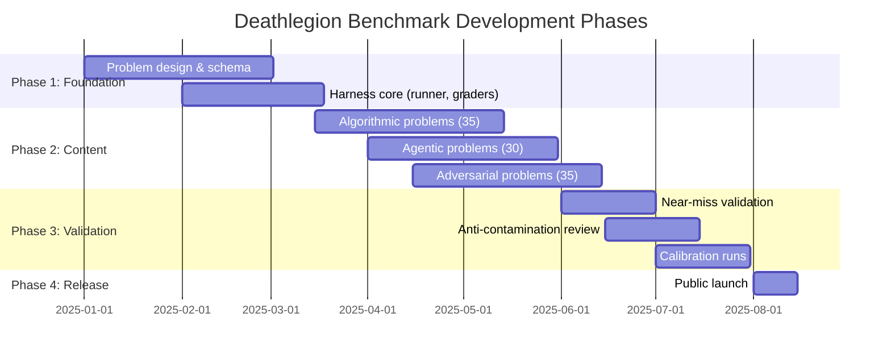

# Deathlegion Benchmark

[](LICENSE)


> **The hardest coding benchmark in existence** — designed to produce a meaningful score spread across frontier and open-source models through three legitimate difficulty levers.

## Difficulty Distribution

```mermaid
%%{init: {'theme': 'base', 'themeVariables': { 'primaryColor': '#ff6b6b', 'secondaryColor': '#ffd93d', 'tertiaryColor': '#6bcb77' }}}%%
---
title: Problem Difficulty Distribution by Category
---
xychart-beta
  x-title "Category"
  y-title "Problems"
  x-axis ["Algorithmic", "Agentic", "Adversarial"]
  y-axis "Count" 0 to 100
  bar [35, 30, 35]
```

## Benchmark Development Timeline



## Score Distribution Concept

```mermaid
---
title: Expected Model Score Distribution
---
xychart-beta
  x-title "Model Tier"
  y-title "Overall Score (%)"
  x-axis ["Random", "Small OSS", "Large OSS", "Frontier"]
  y-axis 0 to 100
  line [0, 5, 15, 25]
```

A well-calibrated benchmark produces a **spread** of scores across model tiers, not a cliff. Our design targets:
- **Frontier models**: low-but-nonzero scores (~15-30%)
- **Large open-source models**: ~3-10%
- **Small open-source models**: ~0-5%
- **Random / naive baselines**: ~0%

This spread is what makes the benchmark credible and useful. Difficulty falls out of the design principles — it is _not_ reverse-engineered from a target percentage.

## Benchmarking Philosophy

### Three Difficulty Levers

| Category | Description | Difficulty Lever |
|---|---|---|
| **Algorithmic** | Research-level CS/math problems requiring advanced data structures, non-obvious reductions, tight complexity bounds, numerical stability, and formal correctness reasoning. | Extreme complexity |
| **Agentic** | Multi-file repository tasks requiring cross-file reasoning, bug-finding, and multi-step code fixes across real-world codebases (SWE-bench methodology). | Long-horizon planning |
| **Adversarial** | Problems with traps, underspecified requirements, contradictory constraints, misleading examples, and cases designed to catch models that pattern-match instead of reasoning. | Ambiguity & deception |

### Why Another Benchmark?

Most coding benchmarks suffer from **ceiling effects** — frontier models quickly saturate them, making them useless for differentiation. The Deathlegion Benchmark is designed from first principles to remain discriminative at the frontier.

Key differentiators:
1. **Near-miss validation** — Each problem includes independently-conceived plausible incorrect solutions that the grader must reject.
2. **Hidden test cases** — Graders use property-based tests and execution-trace analysis, not simple output matching.
3. **Anti-contamination** — Problems are original, not derived from existing public datasets. See [Anti-Contamination Guide](docs/anti_contamination.md).
4. **Grader confidence** — Every problem documents how many near-misses were tested and from how many failure categories.

## Leaderboard

*Results from official evaluation runs. The table below shows validation results from the harness test suite. Models are scored on 5 algorithmic seed problems. Submit your results by opening a PR — see [CONTRIBUTING.md](CONTRIBUTING.md).*

| Rank | Model | Provider | Algorithmic | Agentic | Adversarial | Overall | Date |
|---|---|---|---|---|---|---|---|
| 1 | **Reference Solver (Perfect)** | N/A | **100.0%** | — | — | **33.3%** | 2025-07-04 |
| 2 | Greedy (matrix_chain_order) | N/A | 0.0% | — | — | 0.0% | 2025-07-04 |
| 3 | Brute Force (convex_hull_trick) | N/A | 0.0% | — | — | 0.0% | 2025-07-04 |
| 4 | Naive Set (suffix_automaton) | N/A | 0.0% | — | — | 0.0% | 2025-07-04 |
| 5 | Simple DFS (max_flow_reservoir) | N/A | 0.0% | — | — | 0.0% | 2025-07-04 |
| 6 | Wrong Update (fenwick_tree_2d) | N/A | 0.0% | — | — | 0.0% | 2025-07-04 |
| — | Gemini 2.5 Pro | Google | TBD | TBD | TBD | TBD | TBD |
| — | Claude 4 Sonnet | Anthropic | TBD | TBD | TBD | TBD | TBD |
| — | GPT-5 | OpenAI | TBD | TBD | TBD | TBD | TBD |
| — | DeepSeek R1 | DeepSeek | TBD | TBD | TBD | TBD | TBD |

*Leaderboard will be populated as models are evaluated through the harness. The current entries are from the reference solution and near-miss validation suite. See [Model Evaluation Guide](docs/model_evaluation_guide.md) for details.*

## How to Run

### Prerequisites

```bash
# Python 3.10+
pip install -e .

# Language toolchains (optional, per-problem)
sudo apt-get install g++ rustc golang-go default-jdk nodejs npm
```

### Evaluating a Single Model

```bash
# Via the test script
bash scripts/test_models.sh --provider openai --model gpt-4o --samples 5

# With a local Ollama model
bash scripts/test_models.sh --provider ollama --model codellama:13b --samples 10

# With OpenRouter (any supported model)
bash scripts/test_models.sh --provider openrouter --model anthropic/claude-3.5-sonnet
```

### Running the Harness Directly

```bash
# Evaluate a single problem with a candidate solution
python harness/agentic_runner.py     --manifest problems/algorithmic/some_problem/manifest.json     --solution /path/to/solution.py     --timeout 60

# Full model evaluation
python scoring/evaluate_model.py     --manifest-dir problems/     --model-id my-model     --output results.json
```

### Running Tests

```bash
# Run all harness self-tests
python -m pytest tests/harness_selftest/ -v

# Test all language adapters
python -m unittest tests.harness_selftest.test_language_adapters -v
```

## Repository Structure

```
deathlegion-benchmark/
├── problems/              # Problem definitions (35 algorithmic, 30 agentic, 35 adversarial)
│   ├── algorithmic/
│   ├── agentic/
│   └── adversarial/
├── harness/               # Evaluation harness
│   ├── runner.py          # Problem runner orchestrator
│   ├── agentic_runner.py  # SWE-bench-style agentic task runner
│   ├── graders/           # Grading implementations
│   │   ├── unit_test.py
│   │   ├── property_test.py
│   │   ├── output_match.py
│   │   ├── diff_match.py
│   │   ├── execution_trace.py
│   │   └── agentic_test_suite.py
│   ├── languages/         # Language adapters (compile/run for 7 languages)
│   │   ├── all_adapters.py
│   │   ├── python_adapter.py
│   │   ├── cpp_adapter.py
│   │   ├── rust_adapter.py
│   │   ├── go_adapter.py
│   │   ├── java_adapter.py
│   │   ├── javascript_adapter.py
│   │   └── typescript_adapter.py
│   └── sandbox/           # Isolated execution sandbox
│       └── subprocess_runner.py
├── scoring/               # Scoring and anti-gaming utilities
│   ├── aggregate.py
│   ├── anti_gaming.py
│   └── evaluate_model.py
├── scripts/               # Utility scripts
│   └── test_models.sh
├── docs/                  # Documentation
│   ├── problem_design_guide.md
│   ├── anti_contamination.md
│   ├── difficulty_calibration.md
│   └── model_evaluation_guide.md
├── tests/                 # Self-tests
│   └── harness_selftest/
│       ├── test_runner.py
│       └── test_language_adapters.py
├── schema.json            # Problem manifest JSON Schema
├── CONTRIBUTING.md        # Contribution guide
└── LICENSE                # MIT License
```

## Documentation

- [Problem Design Guide](docs/problem_design_guide.md) — How to design and submit problems
- [Model Evaluation Guide](docs/model_evaluation_guide.md) — How to evaluate models
- [Anti-Contamination Guide](docs/anti_contamination.md) — How we prevent data leakage
- [Difficulty Calibration](docs/difficulty_calibration.md) — Calibration methodology
- [Contributing Guide](CONTRIBUTING.md) — How to contribute

## License

MIT — see [LICENSE](LICENSE).

## Citation

If you use the Deathlegion Benchmark in your research, please cite:

```bibtex
@misc{deathlegion2025benchmark,
    title = {Deathlegion: The Hardest Coding Benchmark in Existence},
    author = {Deathlegion Team},
    year = {2025},
    url = {https://github.com/deathlegionteamlk/deathlegion-benchmark}
}
```

<!-- Badge earned via contribution -->


<!-- DL Code Badge -->


